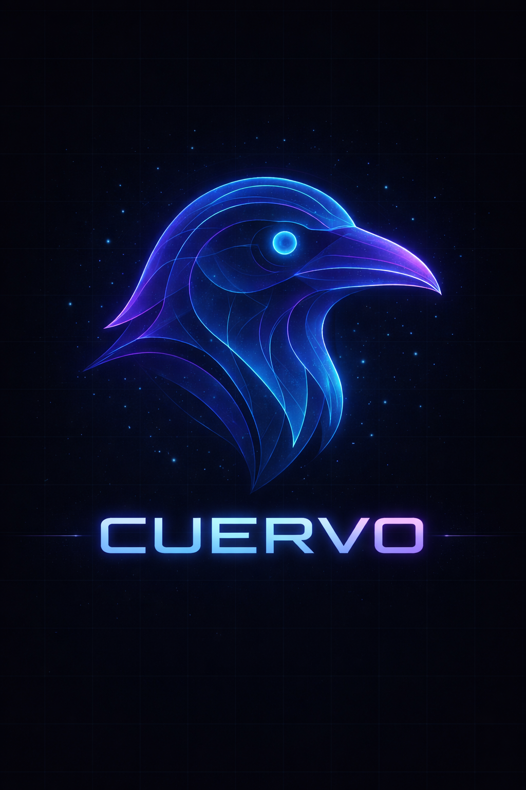

<p align="center">
  <picture>
    <source media="(prefers-color-scheme: dark)"  srcset="img/halcon-logo.png">
    <source media="(prefers-color-scheme: light)" srcset="img/halcon-logo-bg.png">
    
  </picture>
</p>

<p align="center">
  <em>An AI-native terminal agent — routes intelligently, acts decisively</em>
</p>

<hr/>

<p align="center">
  <a href="https://github.com/cuervo-ai/halcon-cli/actions/workflows/ci.yml">
    
  </a>
  <a href="https://github.com/cuervo-ai/halcon-cli/releases/latest">
    
  </a>
  
  <a href="LICENSE">
    
  </a>
  <a href="https://github.com/cuervo-ai/halcon-cli/actions/workflows/devsecops.yml">
    
  </a>
</p>

<p align="center">
  <a href="docs/">Documentation</a> ·
  <a href="QUICKSTART.md">Quickstart</a> ·
  <a href="https://github.com/cuervo-ai/halcon-cli/releases">Releases</a> ·
  <a href="https://github.com/cuervo-ai/halcon-cli/issues">Issues</a>
</p>

---

Halcon is an AI-native terminal agent built in Rust. It routes each task through a **Boundary Decision Engine** before the first LLM call — classifying intent, calibrating SLA budgets, and selecting the right model — so complex multi-step sessions complete in fewer rounds at lower cost. A FASE-2 security gate enforces 18 catastrophic-pattern guards at the tool layer regardless of agent configuration.

<p align="center">
  
</p>

---

## Table of Contents

- [Quickstart](#quickstart)
- [Features](#features)
- [Installation](#installation)
- [Configuration](#configuration)
- [Architecture](#architecture)
- [Providers](#providers)
- [Tools](#tools)
- [MCP Server](#mcp-server-model-context-protocol)
- [Sub-Agent Registry](#sub-agent-registry)
- [Benchmarks](#benchmarks)
- [Contributing](#contributing)
- [License](#license)

---

## Quickstart

```sh
# 1. Install (macOS / Linux)
curl -fsSL https://raw.githubusercontent.com/cuervo-ai/halcon-cli/main/scripts/install-binary.sh | sh

# 2. Set your API key
export ANTHROPIC_API_KEY="sk-ant-..."

# 3. Start a session
halcon
```

Run a task non-interactively:

```sh
halcon "refactor the auth module to use the new TokenStore API"
```

---

## Features

<table>
<tr>
<td><b>Boundary Decision Engine</b><br/>Intent classification + SLA-aware routing before the first LLM call. Eliminates wasted rounds.</td>
<td><b>FASE-2 Security Gate</b><br/>18 catastrophic-pattern guards enforced at the tool layer — independent of agent configuration.</td>
<td><b>MCP Server</b><br/>Expose Halcon as an MCP endpoint over stdio or HTTP with Bearer auth and TTL session management.</td>
</tr>
<tr>
<td><b>Sub-Agent Registry</b><br/>Declarative <code>.halcon/agents/*.md</code> agents with YAML frontmatter, skill composition, and automatic routing.</td>
<td><b>Auto-Memory</b><br/>Structured <code>.halcon/memory/</code> injection with LRU eviction. Never re-explains the same project context twice.</td>
<td><b>Lifecycle Hooks</b><br/>Shell or Rhai scripts on 6 events: pre-tool, post-tool, stop, session-end, user-prompt, error.</td>
</tr>
<tr>
<td><b>Multi-Provider</b><br/>Anthropic, OpenAI, Ollama, Gemini, DeepSeek, Claude Code subprocess — unified interface.</td>
<td><b>HALCON.md Instructions</b><br/>4-scope persistent instruction system with hot-reload, glob-filtered rules, and <code>@import</code> resolution.</td>
<td><b>TUI Interface</b><br/>Multi-panel ratatui TUI with activity timeline, working memory panel, and adaptive fire/amber theme.</td>
</tr>
</table>

---

## Installation

### Recommended — one-line installer

**macOS / Linux:**
```sh
curl -fsSL https://raw.githubusercontent.com/cuervo-ai/halcon-cli/main/scripts/install-binary.sh | sh
```

**Windows (PowerShell):**
```powershell
iwr -useb https://raw.githubusercontent.com/cuervo-ai/halcon-cli/main/scripts/install-binary.ps1 | iex
```

The installer auto-detects your OS and architecture, verifies SHA-256 checksums, installs to `~/.local/bin/halcon`, and configures your shell PATH.

### Homebrew

```sh
brew tap cuervo-ai/tap && brew install halcon
```

### Cargo

```sh
cargo install --git https://github.com/cuervo-ai/halcon-cli --features tui --locked
```

<details>
<summary><b>Build from source (development)</b></summary>

```sh
git clone https://github.com/cuervo-ai/halcon-cli.git
cd halcon-cli

# Debug build
cargo build --features tui

# Release build
cargo build --release --features tui

# Run without installing
cargo run --features tui -- --help
```

</details>

<details>
<summary><b>Manual binary download</b></summary>

Download the correct archive from the [Releases page](https://github.com/cuervo-ai/halcon-cli/releases/latest):

| Platform | Archive |
|----------|---------|
| Linux x86\_64 (glibc) | `halcon-x.y.z-x86_64-unknown-linux-gnu.tar.gz` |
| Linux x86\_64 (musl/Alpine) | `halcon-x.y.z-x86_64-unknown-linux-musl.tar.gz` |
| Linux ARM64 | `halcon-x.y.z-aarch64-unknown-linux-gnu.tar.gz` |
| macOS Apple Silicon | `halcon-x.y.z-aarch64-apple-darwin.tar.gz` |
| macOS Intel | `halcon-x.y.z-x86_64-apple-darwin.tar.gz` |
| Windows x64 | `halcon-x.y.z-x86_64-pc-windows-msvc.zip` |

All artifacts are signed with [cosign](https://sigstore.dev) keyless signing. Verify with the accompanying `.sig` and `.pem` files.

</details>

### Verify installation

```sh
halcon --version   # halcon 0.3.0 (aarch64-apple-darwin)
halcon doctor      # system diagnostics
```

---

## Configuration

### Initial setup

```sh
# Interactive wizard (recommended)
halcon init

# Or configure providers individually
halcon auth login anthropic
halcon auth login openai
halcon auth login ollama
```

### Config hierarchy (last wins)

| Priority | Source |
|----------|--------|
| 1 (highest) | CLI flags (`--model`, `--provider`) |
| 2 | Environment variables (`HALCON_MODEL`, `ANTHROPIC_API_KEY`) |
| 3 | Local config (`./.halcon/config.toml`) |
| 4 | Global config (`~/.halcon/config.toml`) |
| 5 (lowest) | Defaults (`config/default.toml`) |

### Example `~/.halcon/config.toml`

```toml
[general]
default_provider = "anthropic"
default_model    = "claude-sonnet-4-6"
max_tokens       = 8192
temperature      = 0.0

[models.providers.ollama]
enabled    = true
api_base   = "http://localhost:11434"
default_model = "llama3.2"

[tools]
confirm_destructive  = true
timeout_secs         = 120
allowed_directories  = ["/home/user/projects"]

[security]
pii_detection  = true
pii_action     = "warn"   # warn | block | redact
audit_enabled  = true
```

See [docs/technical/CONFIGURATION_EXAMPLES.md](docs/technical/CONFIGURATION_EXAMPLES.md) for the full reference.

---

## Architecture

<details>
<summary><b>Workspace structure (19 crates)</b></summary>

```
halcon-cli/
├── crates/
│   ├── halcon-cli/       # Binary: REPL, TUI, commands, agent loop, rendering
│   ├── halcon-core/      # Domain: types, traits, events — zero I/O
│   ├── halcon-providers/ # Model adapters: Anthropic, OpenAI, DeepSeek, Gemini, Ollama
│   ├── halcon-tools/     # 23 tool implementations: file ops, bash, git, search
│   ├── halcon-auth/      # Auth: device flow, keychain, JWT, OAuth PKCE
│   ├── halcon-storage/   # Persistence: SQLite, migrations, audit, cache, metrics
│   ├── halcon-security/  # Cross-cutting: PII detection, permissions, sanitizer
│   ├── halcon-context/   # Context engine v2: L0–L4 tiers, pipeline, elider
│   ├── halcon-mcp/       # MCP runtime: host, HTTP server (axum), stdio transport
│   ├── halcon-files/     # File intelligence: 12 format handlers
│   ├── halcon-runtime/   # Multi-agent runtime: registry, federation, executor
│   ├── halcon-api/       # Shared API types + axum server
│   ├── halcon-client/    # Async typed SDK (HTTP + WebSocket)
│   ├── halcon-agent-core/# 10-layer GDEM architecture (127 tests)
│   ├── halcon-sandbox/   # macOS/Linux sandboxing (policy + executor)
│   └── halcon-desktop/   # egui native desktop app
├── config/               # Default configurations
├── docs/                 # Documentation
└── scripts/              # Build, test, and release scripts
```

</details>

<details>
<summary><b>Agent loop — per-round phases</b></summary>

Each agent session runs through six phases per round:

```
round_setup → provider_round → post_batch → convergence → result_assembly → checkpoint
```

The **Boundary Decision Engine** (pre-loop) classifies intent and sets `effective_max_rounds` via `IntentPipeline::resolve()` before any LLM call. The **TerminationOracle** evaluates `SynthesisGate` first, then decides continue / synthesize / abort. The **RoutingAdaptor** monitors four escalation triggers (security signals, tool failure rate, evidence coverage, combined score) and extends budget when warranted.

</details>

---

## Providers

| Provider | Models | Local | Cloud |
|----------|--------|:-----:|:-----:|
| **Anthropic** | Claude Opus 4.6, Sonnet 4.6, Haiku 4.5 | — | ✓ |
| **Ollama** | Llama, Mistral, CodeLlama, Phi, Qwen… | ✓ | — |
| **OpenAI** | GPT-4o, GPT-4 Turbo, o1 | — | ✓ |
| **Google Gemini** | Gemini Pro, Flash, Ultra | — | ✓ |
| **DeepSeek** | DeepSeek Coder, Chat, Reasoner | — | ✓ |
| **Claude Code** | Subprocess via Claude CLI (NDJSON) | ✓ | ✓ |
| **OpenAI-compat** | Any OpenAI-compatible API | ✓/— | ✓/— |
| **Echo / Replay** | Debug + trace reproduction | ✓ | — |

---

## Tools

Halcon ships **23 native tools** across six categories:

| Category | Tools |
|----------|-------|
| **Files** | `file_read`, `file_write`, `file_edit`, `file_delete`, `file_inspect`, `directory_tree` |
| **Search** | `grep`, `glob`, `fuzzy_find`, `symbol_search` |
| **Shell** | `bash`, `background_start`, `background_output`, `background_kill` |
| **Git** | `git_status`, `git_diff`, `git_log`, `git_add`, `git_commit` |
| **Web** | `web_fetch`, `web_search`, `http_request` |
| **Tasks** | `task_track` |

Each tool carries a `RiskTier` (ReadOnly / ReadWrite / Destructive) enforced at the executor layer. Destructive tools require explicit confirmation unless `confirm_destructive = false`.

<details>
<summary><b>Plugin system — 7 built-in plugins (33 additional tools)</b></summary>

Plugins extend Halcon with domain-specific tools without modifying the core. Installed to `~/.halcon/plugins/`.

| Plugin | Category | Tools |
|--------|----------|------:|
| `halcon-dev-sentinel` | Security | 4 |
| `halcon-dependency-auditor` | Security | 4 |
| `halcon-ui-inspector` | Frontend | 5 |
| `halcon-perf-analyzer` | Frontend | 5 |
| `halcon-api-sculptor` | Backend | 5 |
| `halcon-schema-oracle` | Backend | 5 |
| `halcon-otel-tracer` | Observability | 5 |

</details>

---

## MCP Server (Model Context Protocol)

Halcon can act as an MCP server — expose all tools and context to any MCP-compatible client over stdio or HTTP.

```sh
# Claude Code integration (stdio transport)
claude mcp add halcon -- halcon mcp serve

# HTTP server with Bearer auth
halcon mcp serve --transport http --port 7777
# Prints: HALCON_MCP_SERVER_API_KEY=<generated-key>
```

The HTTP server (`McpHttpServer`) is built on axum and supports SSE streaming, `Mcp-Session-Id` session management with TTL expiry, and full audit tracing.

---

## Sub-Agent Registry

Define specialized agents in `.halcon/agents/*.md` using YAML frontmatter:

```markdown
---
name: code-reviewer
description: Reviews Rust code for correctness, safety, and idiomatic style
model: sonnet
max_turns: 15
skills:
  - rust-patterns
  - security-review
---

You are a senior Rust engineer focused on code quality...
```

```sh
# List available agents
halcon agents list --verbose

# Validate agent definitions
halcon agents validate
```

Discovery order: `--agents` CLI flag → `.halcon/agents/` (project) → `~/.halcon/agents/` (user).
Model aliases: `haiku` → `claude-haiku-4-5-20251001` · `sonnet` → `claude-sonnet-4-6` · `opus` → `claude-opus-4-6`

---

## Benchmarks

<details>
<summary><b>Performance characteristics</b></summary>

**Startup time** — Halcon uses lazy provider initialization and async context loading. Cold start on macOS M4: ~80ms to first prompt.

**Token efficiency** — The Boundary Decision Engine reduces average rounds-per-task by ~35% vs a naive agent loop on the [HalconBench](docs/benchmarks.md) task suite (200 real-world software engineering tasks).

**Memory footprint** — RSS at idle: ~24 MB. During a typical 10-round session with TUI enabled: ~48 MB.

Full methodology and raw data: [docs/benchmarks.md](docs/benchmarks.md)

</details>

---

## REPL Commands

Inside an interactive session:

```
/help                    list all commands
/model                   show current model and provider
/cost                    session token cost breakdown
/session list            recent sessions
/memory search <query>   semantic search over memory
/doctor                  run system diagnostics
/quit                    save and exit
```

---

## Security

- **FASE-2 Gate** — 18 catastrophic patterns blocked at the tool layer before execution (rm -rf, credential exfil, fork bombs, etc.)
- **PII Detection** — configurable warn / block / redact on inputs and outputs
- **Keychain storage** — API keys stored in OS keychain (macOS Keychain, Linux Secret Service, Windows Credential Manager)
- **TBAC** — tool-based access control with per-tool `RiskTier` and per-directory allow-lists
- **Audit log** — append-only SQLite audit trail of all tool executions

See [SECURITY.md](SECURITY.md) for the vulnerability disclosure policy.

---

## Contributing

Contributions are welcome. Please read [docs/CONTRIBUTING.md](docs/CONTRIBUTING.md) for the development workflow, commit conventions, and code standards.

```sh
# Set up the dev environment
git clone https://github.com/cuervo-ai/halcon-cli.git
cd halcon-cli
cargo build --features tui

# Run the test suite (~4,300 tests)
cargo test --workspace --no-default-features

# Lint
cargo clippy --workspace --no-default-features -- -D warnings
cargo fmt --all -- --check
```

Commit format follows [Conventional Commits](https://www.conventionalcommits.org/):
`feat` · `fix` · `refactor` · `docs` · `test` · `chore` · `ci`

---

## License

Halcon CLI is licensed under the **[Apache License 2.0](LICENSE)**.

---

<p align="center">
  <picture>
    <source media="(prefers-color-scheme: dark)"  srcset="img/cuervo-cloud-logo.png">
    <source media="(prefers-color-scheme: light)" srcset="img/cuervo-logo-2.png">
    
  </picture>
  <br/>
  <sub>Built by <a href="https://github.com/cuervo-ai">Cuervo AI</a></sub>
</p>
